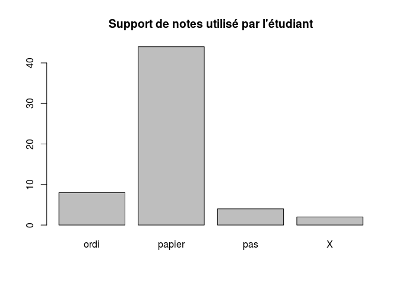

# Questionnaire étudiant
Sebri, JcB  
19/02/2015  

Questionnaire étudiant
======================


```
##  [1] "X"       "X.1"     "Q1"      "Q2.1"    "Q2.2"    "Q2.3"    "Q2.4"   
##  [8] "Q2.5"    "Q2.6"    "Q3.1tpc" "Q3.2sp"  "Q3.3tab" "Q3.4ord" "Q4.1"   
## [15] "Q4.2"    "Q4.3"    "Q4.4"    "Q4.5"    "Q4.6"    "Q4.7"    "Q4.8"   
## [22] "Q4.9"    "Q4.10"   "Q4.11"   "Q4.12"   "Q4.13"   "Q4.14"   "Q4.15"  
## [29] "Q4.16"   "Q5"      "Q6"      "Q7.1"    "Q7.2"    "Q7.3"    "Q7.4"   
## [36] "Q7.5"    "Q7.6"    "Q7.7"    "Q7.8"    "Q7.9"    "Q7.10"   "Q7.11"  
## [43] "Q7.12"   "Q7.13"   "Q7.14"   "Q7.15"   "Q7.16"   "Q8"      "Q9"     
## [50] "Q10"     "Q11"
```

Q1- Pour ce cours, vous avez pris des notes
--------------------------------------------


```
  ordi papier    pas      X 
     8     44      4      2 
```

 

Q2- Pendant ce cours, vous avez complété la prise de notes par (plusieurs réponses possibles)
---------------------------------------------------------------------------------------------
La variable Q2.5 est anormale. Il ne peut y avoir dans la même colonne du texte et des nombres. La colonne ne peut contenir que 1 ou NA. Créer une colnne supplémentaire pour le texte. Par ex. Q2-7.

 

Information de session
======================


```
## R version 3.1.2 (2014-10-31)
## Platform: x86_64-pc-linux-gnu (64-bit)
## 
## locale:
##  [1] LC_CTYPE=fr_FR.UTF-8       LC_NUMERIC=C              
##  [3] LC_TIME=fr_FR.UTF-8        LC_COLLATE=fr_FR.UTF-8    
##  [5] LC_MONETARY=fr_FR.UTF-8    LC_MESSAGES=fr_FR.UTF-8   
##  [7] LC_PAPER=fr_FR.UTF-8       LC_NAME=C                 
##  [9] LC_ADDRESS=C               LC_TELEPHONE=C            
## [11] LC_MEASUREMENT=fr_FR.UTF-8 LC_IDENTIFICATION=C       
## 
## attached base packages:
## [1] stats     graphics  grDevices utils     datasets  methods   base     
## 
## loaded via a namespace (and not attached):
## [1] digest_0.6.4    evaluate_0.5.5  formatR_1.0     htmltools_0.2.6
## [5] knitr_1.9       rmarkdown_0.5.1 stringr_0.6.2   tools_3.1.2    
## [9] yaml_2.1.13
```

