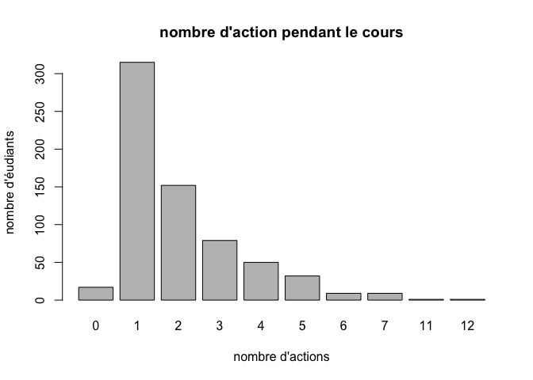

# Questionnaire étudiant
Sebri, JcB  
19/02/2015  

Questionnaire étudiant
======================


```
##  [1] "Etab"    "Etud"    "Q1"      "Q2.1"    "Q2.2"    "Q2.3"    "Q2.4"   
##  [8] "Q2.5"    "Q2.6"    "Q2.7"    "Q3.1tpc" "Q3.2sp"  "Q3.3tab" "Q3.4ord"
## [15] "Q4.1"    "Q4.2"    "Q4.3"    "Q4.4"    "Q4.5"    "Q4.6"    "Q4.7"   
## [22] "Q4.8"    "Q4.9"    "Q4.10"   "Q4.11"   "Q4.12"   "Q4.13"   "Q4.14"  
## [29] "Q4.15"   "Q4.16"   "Q5"      "Q6"      "Q7.1"    "Q7.2"    "Q7.3"   
## [36] "Q7.4"    "Q7.5"    "Q7.6"    "Q7.7"    "Q7.8"    "Q7.9"    "Q7.10"  
## [43] "Q7.11"   "Q7.12"   "Q7.13"   "Q7.14"   "Q7.15"   "Q7.16"   "Q8"     
## [50] "Q9"      "Q10"     "Q11"
```

```
## Loading required package: foreign
## Loading required package: survival
## Loading required package: MASS
## Loading required package: nnet
```
Le fichier comporte:

- 665 lignes
- 52 variables

Etablissements participant:
---------------------------

```r
s <- summary(as.factor(d1$Etab))
s
```

```
##   C1   H1 HUS1 HUS2   M1  Sa1  SV1 
##  120   56  162   60  146   42   79
```

```r
pie(s)
```

 

Age
---

```r
summary(d1$Q11)
```

```
##    Min. 1st Qu.  Median    Mean 3rd Qu.    Max.    NA's 
##   17.00   20.00   21.00   23.48   25.00   48.00      11
```

```r
hist(d1$Q11, main = "Histogramme de l'age", xlab = "Age", ylab = "Fréquence")
```

 

Sexe
----
    

```r
summary(as.factor(d1$Q10))
```

```
##    F    H   NR NA's 
##  549  108    3    5
```

```


Q1- Pour ce cours, vous avez pris des notes
--------------------------------------------


```
  ordi papier    pas      X 
   154    365     97     49 
```

 

Q2- Pendant ce cours, vous avez complété la prise de notes par (plusieurs réponses possibles)
---------------------------------------------------------------------------------------------
La variable Q2.5 est anormale. Il ne peut y avoir dans la même colonne du texte et des nombres. La colonne ne peut contenir que 1 ou NA. Créer une colnne supplémentaire pour le texte. Par ex. Q2-7.

 

Q3- Quels sont les outils numériques que vous aviez avec vous pendant ce cours? (plusieurs réponses possibles)
------------------------------------
Colonne 11 à 14

#### téléphone portable classique
colonnes 10: ():non, oui sur la table= ot,	oui dans mon sac ou ma poche= osp

 

```
d1$Q3.1tpc : 
        Frequency Percent Cum. percent
non           391    58.8         58.8
NR            141    21.2         80.0
osp            86    12.9         92.9
ot             47     7.1        100.0
  Total       665   100.0        100.0
```

Q4- Pendant ce cours (en dehors des temps de pause éventuels), vous avez utilisé votre téléphone pour (plusieurs réponses possibles):
----------------------------------------------
question 15 à 30

```r
d1 <- read.csv(paste0(path, file1), skip = 1, stringsAsFactors = FALSE)

q4 <- d1[, c(15:26, 28:30)]
q4 <- as.data.frame(sapply(q4,gsub,pattern="NR",replacement="NA"), , stringsAsFactors = FALSE)
q4 <- as.data.frame(sapply(q4, as.integer))
a <- apply(q4,2,sum, na.rm = TRUE)
x <- barplot(sort(a, decreasing = TRUE), las = 2, main = "Utilisation du téléphone pendant le cours")
v <- paste0(sort(round(a*100/sum(a), 2), decreasing = TRUE), "%")
text(x, 50, v, srt=90)
```

 

Combien d'actions simultannément:

```r
a <- apply(q4,1,sum, na.rm = TRUE)
summary(a)
```

```
##    Min. 1st Qu.  Median    Mean 3rd Qu.    Max. 
##   0.000   1.000   2.000   2.039   3.000  12.000
```

```r
summary(as.factor(a))
```

```
##   0   1   2   3   4   5   6   7  11  12 
##  17 315 152  79  50  32   9   9   1   1
```

```r
barplot(summary(as.factor(a)), main = "nombre d'action pendant le cours", ylab = "nombre d'éudiants", xlab = "nombre d'actions")
```

 


Information de session
======================


```
## R version 3.1.2 (2014-10-31)
## Platform: x86_64-apple-darwin10.8.0 (64-bit)
## 
## locale:
## [1] fr_FR.UTF-8/fr_FR.UTF-8/fr_FR.UTF-8/C/fr_FR.UTF-8/fr_FR.UTF-8
## 
## attached base packages:
## [1] stats     graphics  grDevices utils     datasets  methods   base     
## 
## other attached packages:
## [1] epicalc_2.15.1.0 nnet_7.3-9       MASS_7.3-39      survival_2.38-1 
## [5] foreign_0.8-63  
## 
## loaded via a namespace (and not attached):
##  [1] digest_0.6.8    evaluate_0.5.5  formatR_1.0     htmltools_0.2.6
##  [5] knitr_1.9       rmarkdown_0.5.1 splines_3.1.2   stringr_0.6.2  
##  [9] tools_3.1.2     yaml_2.1.13
```

