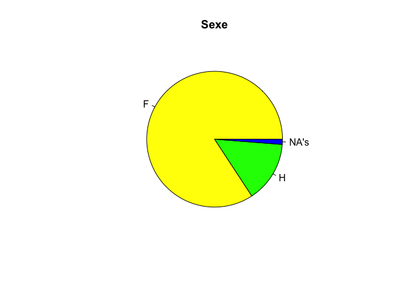

# Questionnaire étudiant
Sebri, JcB  
19/02/2015  


Questionnaire étudiant
======================


```
##  [1] "Etab"    "Etud"    "Q1"      "Q2.1"    "Q2.2"    "Q2.3"    "Q2.4"   
##  [8] "Q2.5"    "Q2.6"    "Q2.7"    "Q3.1tpc" "Q3.2sp"  "Q3.3tab" "Q3.4ord"
## [15] "Q4.1"    "Q4.2"    "Q4.3"    "Q4.4"    "Q4.5"    "Q4.6"    "Q4.7"   
## [22] "Q4.8"    "Q4.9"    "Q4.10"   "Q4.11"   "Q4.12"   "Q4.13"   "Q4.14"  
## [29] "Q4.15"   "Q4.16"   "Q5"      "Q6"      "Q7.1"    "Q7.2"    "Q7.3"   
## [36] "Q7.4"    "Q7.5"    "Q7.6"    "Q7.7"    "Q7.8"    "Q7.9"    "Q7.10"  
## [43] "Q7.11"   "Q7.12"   "Q7.13"   "Q7.14"   "Q7.15"   "Q7.16"   "Q8"     
## [50] "Q9"      "Q10"     "Q11"
```

```
## Loading required package: foreign
## Loading required package: survival
## Loading required package: MASS
## Loading required package: nnet
```
Le fichier comporte:

- 1446 lignes
- 52 variables

Etablissements participant:
---------------------------


```
  B1   B2   C1   C2   C3   E1   H1   H2 HUS1 HUS2 HUS3   M1   M2  Sa1  SV1 
  43   54  120  127  110   58   56   51  162   60  131  146  123   42   79 
 SV2 
  84 
```

 

Age
---

```
   Min. 1st Qu.  Median    Mean 3rd Qu.    Max.    NA's 
   17.0    20.0    22.0    24.1    25.0    53.0      27 
```

 

Sexe
----
    

```
   F    h    H   na NA's 
1218    1  209    1   17 
```

 

               femmes   hommes   inconnu
-----------  --------  -------  --------
nombre        1218.00   210.00     18.00
proportion      84.23    14.52      1.24

Sous forme de tableau
<!-- html table generated in R 3.1.3 by xtable 1.7-4 package -->
<!-- Sun May  3 10:44:02 2015 -->
<table border=1>
<caption align="bottom"> Sexe des participants </caption>
<tr> <th>  </th> <th> femmes </th> <th> hommes </th> <th> inconnu </th>  </tr>
  <tr> <td align="right"> nombre </td> <td align="right"> 1218.00 </td> <td align="right"> 210.00 </td> <td align="right"> 18.00 </td> </tr>
  <tr> <td align="right"> proportion </td> <td align="right"> 84.23 </td> <td align="right"> 14.52 </td> <td align="right"> 1.24 </td> </tr>
   <a name=sexe></a>
</table>

Pie chart
 


Age et sexe
-----------

L'age des hommes et des femmes sont-ils identiques ?
On part de l'hypothèse qu'il n'y a à priori de différence d'age entre les hommes et les femmes (on appelle cela l'hypothèse nulle ou H0). Si cette hypothèse est vraie, la différence des moyennes des ages entre les hommes et les femmes devrait être nulle. En pratique cette différence est rarement exactement égale à 0 et le problème est de savoir si le chiffre obtenu est assimilable à 0 ou si on contraire il est trop important pourqu'on puisse se livrer à cette assimilation, auquel cas on est obligé de renoncer à l'hypothèse nulle et accepter l'hypothèse alternative: l'age des hommes est en moyenne différent de celui des femmes.
Pour répondre à la question, on pratique un test statistique pour lequel on défini un écart par rappport à 0. Si le résultat du test tombe dans l'intervalle on admet que la différence de moyenne est assimilable à 0 et on accepte l'hypothèse nulle: pas de différence entre les groupes. Sinon on la recherche. Bien sûr, plus on défini un intervalle important, plus on augmente le risque de se tromper en affirmant qu'il n'y a pas de différence entre les moyennes. C'est ce qu'on appelle le risque de première espèce ou alpha. Dans les science de la santé, ce risque est fixé conssenssuellement (et arbitrairement) à 5% = 5/100 = 0.05 et généralement rapporté sous la forme p = 0.05
C'est à dire que j'admet H0 (pas de différence) en prenant le risque conssenti de me tromper dans 5% des cas.
En pratique les logiciels calculent la probabilité exacte d'observer par hasard une telle différence entre les deux groupes. Si cette probabilité est supérieure à 0.05 (cad comprise entre 0.05 et 1) on considère que la différence entre les moyennes est un artefact lié au fluctuation d'échantillonnage et qu'en réalité il n'y a pas de différence entre les groupes. Si au contraire, la probabilité exacte est inférieure à 0.05, on admet qu'elle n'est pas due au hasard et on est obligé d'admettre qu'il y a bien une différence entre les deux groupes. On voit par là le côté arbitraire du petit p, mais il est considéré dans toutes les publications comme un chiffre magique...

Il existe de nombreux tests statistiques. Pour répondre à la question posée, on utilise le test t de Student qui s'applique si:

- on ne compare que 2 groupes (c'est le cas)
- la variable d'intérêt (ici l'age) suit une loi normale (on va admettre que oui) dans les 2 groupes
- la variance (moyenne des écarts à la moyenne) des 2 groupes est égale (si ce n'est pas le cas, on peut utiliser une variante de test de Student appelée test de Welch).

La colonne sexe (Q10) comporte 3 valeurs: H, F et NR. Il faut éliminer les NR en les transformant en NA pour rendre le test possible

```r
d1$Q10 <- toupper(d1$Q10)
d1$Q10[d1$Q10 == "NR"] <- NA
```
Puis faire le test:

```r
t <- t.test(d1$Q11 ~ d1$Q10, var.equal = TRUE)
t
```

```
## 
## 	Two Sample t-test
## 
## data:  d1$Q11 by d1$Q10
## t = -3.7563, df = 1415, p-value = 0.0001795
## alternative hypothesis: true difference in means is not equal to 0
## 95 percent confidence interval:
##  -2.7497617 -0.8630462
## sample estimates:
## mean in group F mean in group H 
##        23.82645        25.63285
```

```r
p.t <- t$p.value
```
On voit que la probabilité exacte d'observer <b>par hasard</b> une telle différence entre les moyennes est égale à 0.0001795. Cette probabilité est très inférieure à 0.05 et donc on rejette l'hypothèse d'égalité des ages. En moyenne, pour cet échantillon, les étudiants hommes sont plus agés que les étudiantes et cette différence est statistiquement significative.

Comme on peut avoir un doute sérieux sur la normalité de l'age (voir le graphique des ages ci-dessus), on réalise un test non paramétrique, c'est à  dire qui ne fait pas d'hypothèse sur la façon dont la variable est distribuée. Dans le cas particulier on utilise le test de Wilcoxon qui est l'équivalent non paramétrique du test de Student:


```r
wilcox.test(d1$Q11 ~ d1$Q10)
```

```
## 
## 	Wilcoxon rank sum test with continuity correction
## 
## data:  d1$Q11 by d1$Q10
## W = 97211, p-value = 0.0000002159
## alternative hypothesis: true location shift is not equal to 0
```
On arrive à la même conclusion.


Q1- Pour ce cours, vous avez pris des notes
--------------------------------------------


```r
s <- summary(as.factor(d1$Q1))
s
```

```
##   ordi papier    pas      X 
##    410    720    232     84
```

```r
barplot(s, main = "Support de notes utilisé par l'étudiant")
```

 

Q2- Pendant ce cours, vous avez complété la prise de notes par (plusieurs réponses possibles)
---------------------------------------------------------------------------------------------
La variable Q2.5 est anormale. Il ne peut y avoir dans la même colonne du texte et des nombres. La colonne ne peut contenir que 1 ou NA. Créer une colnne supplémentaire pour le texte. Par ex. Q2-7.

 

Q3- Quels sont les outils numériques que vous aviez avec vous pendant ce cours? (plusieurs réponses possibles)
------------------------------------
Colonnes 11 à 14

#### téléphone portable classique
colonnes 10: ():non, oui sur la table= ot,	oui dans mon sac ou ma poche= osp

 

```
d1$Q3.1tpc : 
        Frequency Percent Cum. percent
na            291    20.1         20.1
non           855    59.1         79.3
osp           163    11.3         90.5
ot            137     9.5        100.0
  Total      1446   100.0        100.0
```

Q4- Pendant ce cours (en dehors des temps de pause éventuels), vous avez utilisé votre téléphone pour (plusieurs réponses possibles):
----------------------------------------------
question 15 à 30


```r
d1 <- read.csv(paste0(path, file1), skip = 1, stringsAsFactors = FALSE)

q4 <- d1[, c(15:26, 28:30)]
q4 <- as.data.frame(sapply(q4,gsub,pattern="NR",replacement="NA"), , stringsAsFactors = FALSE)
q4 <- as.data.frame(sapply(q4, as.integer))
a <- apply(q4,2,sum, na.rm = TRUE)
x <- barplot(sort(a, decreasing = TRUE), las = 2, main = "Utilisation du téléphone pendant le cours")
v <- paste0(sort(round(a*100/sum(a), 2), decreasing = TRUE), "%")
text(x, 50, v, srt=90)
```

 

Combien d'actions simultannément:


```
   Min. 1st Qu.  Median    Mean 3rd Qu.    Max. 
  0.000   1.000   2.000   2.146   3.000  12.000 
```

```
  0   1   2   3   4   5   6   7   8  11  12 
 42 635 311 207 122  74  31  18   4   1   1 
```

 

Q5- A quelle fréquence, avez-vous utilisé votre téléphone PENDANT ce cours (en dehors des temps de pause éventuels) pour prendre des notes ou chercher sur internet des informations au sujet du cours ?
-----------------------------------------
question 31


```
  1X  jjs jnsp   js   na   NR  nvp  qqf   sv   tt NA's 
 136    1    9  835    6   66   11  251   64    9   58 
```

 

```
as.factor(d1$Q5) : 
        Frequency   %(NA+)   %(NA-)
js            835     57.7     60.2
qqf           251     17.4     18.1
1X            136      9.4      9.8
NR             66      4.6      4.8
sv             64      4.4      4.6
NA's           58      4.0      0.0
nvp            11      0.8      0.8
jnsp            9      0.6      0.6
tt              9      0.6      0.6
na              6      0.4      0.4
jjs             1      0.1      0.1
  Total      1446    100.0    100.0
```


Q6- A quelle fréquence, avez-vous utilisé votre téléphone PENDANT ce cours (en dehors des temps de pause éventuels) pour faire autre chose que prendre des notes ou chercher sur internet des informations au sujet du cours?
----------------------------------------
question 32


```
  1X jnsp   js   na   NR  nvp  qqf   sv   tt NA's 
 183    5  303    3   67   16  524  242   45   58 
```

 

```
as.factor(d1$Q6) : 
        Frequency   %(NA+)   %(NA-)
qqf           524     36.2     37.8
js            303     21.0     21.8
sv            242     16.7     17.4
1X            183     12.7     13.2
NR             67      4.6      4.8
NA's           58      4.0      0.0
tt             45      3.1      3.2
nvp            16      1.1      1.2
jnsp            5      0.3      0.4
na              3      0.2      0.2
  Total      1446    100.0    100.0
```

Q7- Pendant ce cours (en dehors des temps de pause éventuels), vous avez utilisé votre tablette et/ ou votre ordinateur pour (plusieurs réponses possibles):
----------------------------------------
Questions 33 à 48


```
[1] "Analyse de la colonne Q7.13 (réponse libre)"
```

```
                            1          cours  dessinerpaint        docmail 
          1335              1              1              1              1 
      frfiches    inscrcourse        Lemotiv           lire             na 
             1              1              1              3             36 
    notercours    orgdossinfo            ppt       pptcours         prepCV 
            39              1              1              3              2 
 reg_autr_cour   reg_pptander      reg-heure     reg-photos        reg-ppt 
             1              1              1              1              1 
regautre cours       regcours         regppt           shop    suivrecours 
             1              1              1              3              1 
       support  telecharcours            TFE           word           WTFE 
             1              1              3              1              1 
```

 


Q8- A quelle fréquence, avez-vous utilisé votre tablette, et/ ou votre ordinateur PENDANT ce cours (en dehors des temps de pause éventuels) pour prendre des notes ou chercher sur internet des informations au sujet du cours ?
---------------------------------------
question 49
 

```
as.factor(d1$Q8) : 
        Frequency   %(NA+)   %(NA-)
NA's          593     41.0      0.0
tt            329     22.8     38.6
js            279     19.3     32.7
NR             71      4.9      8.3
qqf            64      4.4      7.5
sv             63      4.4      7.4
1X             27      1.9      3.2
nvp            16      1.1      1.9
jnsp            2      0.1      0.2
na              2      0.1      0.2
  Total      1446    100.0    100.0
```


Q9- A quelle fréquence, avez-vous utilisé votre tablette, et/ ou votre ordinateur PENDANT ce cours (en dehors des temps de pause éventuels) pour faire autre chose que prendre des notes ou chercher sur internet des informations au sujet du cours ?
---------------------------------------
question 50

 

```
as.factor(d1$Q9) : 
        Frequency   %(NA+)   %(NA-)
NA's          593     41.0      0.0
js            494     34.2     57.9
qqf            96      6.6     11.3
NR             77      5.3      9.0
1X             76      5.3      8.9
sv             53      3.7      6.2
tt             34      2.4      4.0
nvp            19      1.3      2.2
jnsp            2      0.1      0.2
na              2      0.1      0.2
  Total      1446    100.0    100.0
```


Information de session
======================

Informations pour le chapitre matériel et méthode.


```
R version 3.1.3 (2015-03-09)
Platform: x86_64-apple-darwin13.4.0 (64-bit)
Running under: OS X 10.10.3 (Yosemite)

locale:
[1] fr_FR.UTF-8/fr_FR.UTF-8/fr_FR.UTF-8/C/fr_FR.UTF-8/fr_FR.UTF-8

attached base packages:
[1] stats     graphics  grDevices utils     datasets  methods   base     

other attached packages:
[1] knitr_1.10       xtable_1.7-4     stringr_0.6.2    epicalc_2.15.1.0
[5] nnet_7.3-9       MASS_7.3-40      survival_2.38-1  foreign_0.8-63  

loaded via a namespace (and not attached):
[1] digest_0.6.8      evaluate_0.7      formatR_1.2       highr_0.5        
[5] htmltools_0.2.6   rmarkdown_0.5.3.2 splines_3.1.3     tools_3.1.3      
[9] yaml_2.1.13      
```


