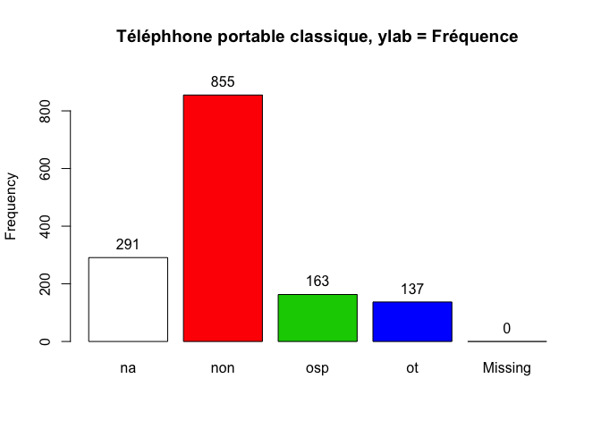

# Questionnaire étudiant
Sebri, JcB  
19/02/2015  

Questionnaire étudiant
======================


```
##  [1] "Etab"    "Etud"    "Q1"      "Q2.1"    "Q2.2"    "Q2.3"    "Q2.4"   
##  [8] "Q2.5"    "Q2.6"    "Q2.7"    "Q3.1tpc" "Q3.2sp"  "Q3.3tab" "Q3.4ord"
## [15] "Q4.1"    "Q4.2"    "Q4.3"    "Q4.4"    "Q4.5"    "Q4.6"    "Q4.7"   
## [22] "Q4.8"    "Q4.9"    "Q4.10"   "Q4.11"   "Q4.12"   "Q4.13"   "Q4.14"  
## [29] "Q4.15"   "Q4.16"   "Q5"      "Q6"      "Q7.1"    "Q7.2"    "Q7.3"   
## [36] "Q7.4"    "Q7.5"    "Q7.6"    "Q7.7"    "Q7.8"    "Q7.9"    "Q7.10"  
## [43] "Q7.11"   "Q7.12"   "Q7.13"   "Q7.14"   "Q7.15"   "Q7.16"   "Q8"     
## [50] "Q9"      "Q10"     "Q11"
```

```
## Loading required package: foreign
## Loading required package: survival
## Loading required package: MASS
## Loading required package: nnet
```
Le fichier comporte:

- 665 lignes
- 52 variables

Etablissements participant:
---------------------------

```
  C1   H1 HUS1 HUS2   M1  Sa1  SV1 
 120   56  162   60  146   42   79 
```

 

Age
---

```
   Min. 1st Qu.  Median    Mean 3rd Qu.    Max.    NA's 
  17.00   20.00   21.00   23.48   25.00   48.00      11 
```

 

Sexe
----
    

```
   F    H   NR NA's 
 549  108    3    5 
```

 

```

Q1- Pour ce cours, vous avez pris des notes
--------------------------------------------


```r
s <- summary(as.factor(d1$Q1))
s
```

```
##   ordi papier    pas      X 
##    154    365     97     49
```

```r
barplot(s, main = "Support de notes utilisé par l'étudiant")
```

 

Q2- Pendant ce cours, vous avez complété la prise de notes par (plusieurs réponses possibles)
---------------------------------------------------------------------------------------------
La variable Q2.5 est anormale. Il ne peut y avoir dans la même colonne du texte et des nombres. La colonne ne peut contenir que 1 ou NA. Créer une colnne supplémentaire pour le texte. Par ex. Q2-7.

 

Q3- Quels sont les outils numériques que vous aviez avec vous pendant ce cours? (plusieurs réponses possibles)
------------------------------------
Colonnes 11 à 14

#### téléphone portable classique
colonnes 10: ():non, oui sur la table= ot,	oui dans mon sac ou ma poche= osp

 

```
d1$Q3.1tpc : 
        Frequency Percent Cum. percent
non           391    58.8         58.8
NR            141    21.2         80.0
osp            86    12.9         92.9
ot             47     7.1        100.0
  Total       665   100.0        100.0
```

Q4- Pendant ce cours (en dehors des temps de pause éventuels), vous avez utilisé votre téléphone pour (plusieurs réponses possibles):
----------------------------------------------
question 15 à 30


```r
d1 <- read.csv(paste0(path, file1), skip = 1, stringsAsFactors = FALSE)

q4 <- d1[, c(15:26, 28:30)]
q4 <- as.data.frame(sapply(q4,gsub,pattern="NR",replacement="NA"), , stringsAsFactors = FALSE)
q4 <- as.data.frame(sapply(q4, as.integer))
a <- apply(q4,2,sum, na.rm = TRUE)
x <- barplot(sort(a, decreasing = TRUE), las = 2, main = "Utilisation du téléphone pendant le cours")
v <- paste0(sort(round(a*100/sum(a), 2), decreasing = TRUE), "%")
text(x, 50, v, srt=90)
```

 

Combien d'actions simultannément:


```
   Min. 1st Qu.  Median    Mean 3rd Qu.    Max. 
  0.000   1.000   2.000   2.039   3.000  12.000 
```

```
  0   1   2   3   4   5   6   7  11  12 
 17 315 152  79  50  32   9   9   1   1 
```

 

Q5- A quelle fréquence, avez-vous utilisé votre téléphone PENDANT ce cours (en dehors des temps de pause éventuels) pour prendre des notes ou chercher sur internet des informations au sujet du cours ?
-----------------------------------------
question 31


```
  1X jnsp   js   NR  nvp  qqf   sv   tt NA's 
  58    4  357   43    7  126   24    4   42 
```

 

```
as.factor(d1$Q5) : 
        Frequency   %(NA+)   %(NA-)
js            357     53.7     57.3
qqf           126     18.9     20.2
1X             58      8.7      9.3
NR             43      6.5      6.9
NA's           42      6.3      0.0
sv             24      3.6      3.9
nvp             7      1.1      1.1
jnsp            4      0.6      0.6
tt              4      0.6      0.6
  Total       665    100.0    100.0
```


Q6- A quelle fréquence, avez-vous utilisé votre téléphone PENDANT ce cours (en dehors des temps de pause éventuels) pour faire autre chose que prendre des notes ou chercher sur internet des informations au sujet du cours?
----------------------------------------
question 32


```
  1X jnsp   js   NR  nvp  qqf   sv   tt NA's 
  86    3  153   43   11  221   91   15   42 
```

 

```
as.factor(d1$Q6) : 
        Frequency   %(NA+)   %(NA-)
qqf           221     33.2     35.5
js            153     23.0     24.6
sv             91     13.7     14.6
1X             86     12.9     13.8
NR             43      6.5      6.9
NA's           42      6.3      0.0
tt             15      2.3      2.4
nvp            11      1.7      1.8
jnsp            3      0.5      0.5
  Total       665    100.0    100.0
```

Q7- Pendant ce cours (en dehors des temps de pause éventuels), vous avez utilisé votre tablette et/ ou votre ordinateur pour (plusieurs réponses possibles):
----------------------------------------
Questions 33 à 48


```
[1] "Analyse de la colonne Q7.13 (réponse libre)"
```

```
                            1       frfiches        Lemotiv           lire 
           625              1              1              1              1 
    notercours             NR            ppt         prepCV     reg-photos 
            17             11              1              1              1 
regautre cours       regcours         regppt           shop 
             1              1              1              2 
```

 


Q8- A quelle fréquence, avez-vous utilisé votre tablette, et/ ou votre ordinateur PENDANT ce cours (en dehors des temps de pause éventuels) pour prendre des notes ou chercher sur internet des informations au sujet du cours ?
---------------------------------------
question 49
 

```
as.factor(d1$Q8) : 
        Frequency   %(NA+)   %(NA-)
NA's          302     45.4      0.0
js            125     18.8     34.4
tt            125     18.8     34.4
sv             35      5.3      9.6
NR             29      4.4      8.0
qqf            27      4.1      7.4
1X             12      1.8      3.3
nvp             9      1.4      2.5
jnsp            1      0.2      0.3
  Total       665    100.0    100.0
```


Q9- A quelle fréquence, avez-vous utilisé votre tablette, et/ ou votre ordinateur PENDANT ce cours (en dehors des temps de pause éventuels) pour faire autre chose que prendre des notes ou chercher sur internet des informations au sujet du cours ?
---------------------------------------
question 50

 

```
as.factor(d1$Q9) : 
        Frequency   %(NA+)   %(NA-)
NA's          302     45.4      0.0
js            203     30.5     55.9
qqf            49      7.4     13.5
1X             32      4.8      8.8
NR             32      4.8      8.8
sv             21      3.2      5.8
tt             14      2.1      3.9
nvp            10      1.5      2.8
jnsp            2      0.3      0.6
  Total       665    100.0    100.0
```


Information de session
======================

Informations pour le chapitre matériel et méthode.


```
R version 3.1.2 (2014-10-31)
Platform: x86_64-apple-darwin10.8.0 (64-bit)

locale:
[1] fr_FR.UTF-8/fr_FR.UTF-8/fr_FR.UTF-8/C/fr_FR.UTF-8/fr_FR.UTF-8

attached base packages:
[1] stats     graphics  grDevices utils     datasets  methods   base     

other attached packages:
[1] epicalc_2.15.1.0 nnet_7.3-9       MASS_7.3-39      survival_2.38-1 
[5] foreign_0.8-63  

loaded via a namespace (and not attached):
 [1] digest_0.6.8    evaluate_0.5.5  formatR_1.0     htmltools_0.2.6
 [5] knitr_1.9       rmarkdown_0.5.1 splines_3.1.2   stringr_0.6.2  
 [9] tools_3.1.2     yaml_2.1.13    
```


